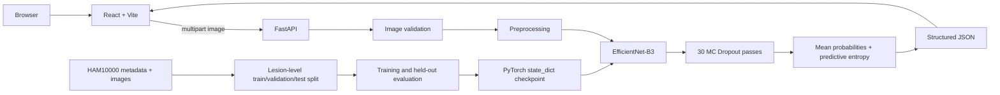

# DermaTriage

DermaTriage is an educational research prototype for classifying dermoscopic images into the seven HAM10000 labels. It reports a model prediction, class probabilities, confidence, MC Dropout predictive entropy, and measured inference latency. **It is not clinically validated and is not a substitute for professional medical diagnosis.** Do not use it to make care decisions.

The application refuses predictions until a trained checkpoint is available. No random or untrained model is used as a fallback. The local HAM10000 dataset has been prepared into lesion-level splits. Training completed across 20 epochs with model selection achieving a Best Validation Macro F1 of 0.6465 (Epoch 15) and Held-Out Test Macro F1 of 0.6419 (Accuracy 78.53%, ROC-AUC 0.9508).

## Project status

The dataset, leakage-safe splits, training, evaluation, uncertainty, standalone inference, API, and dashboard are implemented. The dataset and checkpoints are local and excluded from Git. One training epoch has completed; model selection, final test evaluation, real-model API checks, Docker verification, and cloud deployment remain to be completed. No clinical performance claims are made.

## Architecture



The backend loads its checkpoint once at application startup and shares that CPU model between requests. CPU-bound inference runs in FastAPI's thread pool. Uploads are not retained in application storage or included in logs. Starlette may temporarily spool multipart bodies while parsing a request; it closes those temporary uploads when the request ends.

## Stack

- Python 3.13, PyTorch 2.14, TorchVision 0.29, NumPy, Pandas, scikit-learn, Pillow, Matplotlib
- FastAPI, Pydantic, Uvicorn
- React, Vite, Tailwind CSS, Recharts
- Docker Compose for local integration; GitHub Actions for lint/build/test checks

The existing `.venv` uses CPU PyTorch and remains suitable for the API and CPU inference. For training, the code prefers Intel XPU (Arc), then CUDA, then CPU. It records the selected device with each run.

## Dataset and terms

HAM10000 contains dermoscopic images in seven classes: `akiec`, `bcc`, `bkl`, `df`, `mel`, `nv`, and `vasc`. The standard metadata links an `image_id` to its diagnosis (`dx`) and lesion group (`lesion_id`). It does not provide a patient ID field in the standard metadata. The split code groups on `lesion_id`; related images of a lesion must never cross train, validation, and test boundaries.

Dataset source: [Harvard Dataverse, DOI 10.7910/DVN/DBW86T](https://doi.org/10.7910/DVN/DBW86T). Read and accept the current access/use terms on the repository page before downloading. A [HAM10000 research landing page](https://complexity.cecs.ucf.edu/ham10000/) summarizes the dataset as non-commercial; confirm the current repository terms for your intended use. The open-access license for the paper does not automatically relicense the image files. This prototype is for education/research, and dataset images should not be redistributed from this repository. Check the terms before distributing any trained checkpoint as well. Cite the dataset paper: [Tschandl, Rosendahl & Kittler, Scientific Data (2018)](https://doi.org/10.1038/sdata.2018.161).

After you have read and accepted the applicable dataset terms, place the downloaded files locally:

```text
ml/data/raw/
├── HAM10000_metadata.csv
├── HAM10000_images_part_1/
└── HAM10000_images_part_2/
```

The raw data and processed split files are excluded from Git. Preparation verifies images can be decoded, reports missing/corrupt image IDs, creates deterministic grouped splits, checks lesion-set intersections, and saves class counts plus SHA-256 hashes. Review `ml/data/processed/splits/split_report.json` before training. `patient_id` is not used because it is absent from the standard metadata; lesion-level grouping is the available leakage guard.

### Class balance

The preparation report contains the observed counts. HAM10000 is known to have a strongly uneven class distribution, so plain accuracy can obscure poor performance on smaller categories. Training uses inverse-square-root class weights in cross entropy, calculated only from the training split. That is a moderate weighting strategy; it avoids simultaneously applying a weighted sampler and a weighted loss.

## Environment setup

Use Python 3.13 (already installed on the development machine). Keep the CPU `.venv` for backend inference. For Intel Arc training on Windows, use a separate environment so the CPU environment is unchanged:

PowerShell, from the `DermaTriage` directory:

```powershell
py -3.13 -m venv .venv
.\.venv\Scripts\Activate.ps1
python -m pip install -r requirements-dev.txt
python -c "import torch, torchvision; print(torch.__version__, torchvision.__version__, torch.cuda.is_available())"
```

The Intel XPU wheel build also works with Python 3.13 on Windows. Install the matching official XPU wheels in `.venv-xpu`, then install the project's non-PyTorch training requirements:

```powershell
py -3.13 -m venv .venv-xpu
.\.venv-xpu\Scripts\python.exe -m pip install torch==2.14.0+xpu torchvision==0.29.0+xpu --index-url https://download.pytorch.org/whl/xpu --extra-index-url https://pypi.org/simple
.\.venv-xpu\Scripts\python.exe -m pip install numpy==2.4.2 Pillow==12.1.1 -r ml\requirements-training.txt
.\.venv-xpu\Scripts\python.exe -c "import torch; print(torch.__version__, torch.xpu.is_available()); print(torch.xpu.get_device_name(0) if torch.xpu.is_available() else 'Check the Intel graphics driver')"
```

The project environment is isolated from system Python. Pinning and run metadata record the main libraries, seed, model settings, dataset split hashes, and device for each training run.

## Data preparation and training

From the `DermaTriage` directory, after the data terms are accepted and files are in place. The already-prepared splits do not need to be regenerated. To warm-start from the saved epoch 1 weights using the Intel GPU:

```powershell
.\.venv-xpu\Scripts\python.exe -m ml.src.train --config configs/default.yaml --resume-from ml/models/best_model_before_resume.pth
```

`configs/default.yaml` starts with a 300-pixel EfficientNet-B3, batch size 16, seed 42, 5 frozen-head epochs, and up to 15 lower-learning-rate fine-tuning epochs. The original epoch 1 file had no optimizer state, so the initial restart is a warm start with a new optimizer. New runs atomically update `ml/models/last_model.pth` after every completed epoch with optimizer and scheduler state; resume an interrupted run with:

```powershell
.\.venv-xpu\Scripts\python.exe -B -u -m ml.src.train --config configs/default.yaml --resume-from ml/models/last_model.pth
```

Each completed epoch appends to `ml/experiments/<run-id>/history.csv`. `best_model.pth` is the best validation checkpoint; `last_model.pth` is the latest resumable checkpoint. Saved model and optimizer tensors are CPU-portable. Mixed precision is enabled when CUDA or Intel XPU is selected. If an integrated GPU runs out of memory, lower `batch_size` in `configs/default.yaml` and relaunch from the last checkpoint.

Training basics reflected in the implementation:

- A batch is a group of image tensors processed together; an epoch is one pass through the training split.
- The model outputs logits. Cross entropy compares logits with integer class labels; backpropagation computes gradients and AdamW updates trainable weights.
- ImageNet-pretrained weights supply reusable visual features. The classifier head is trained first; only then are feature layers unfrozen for fine-tuning at a smaller learning rate.
- Train augmentations vary crop, orientation, and mild color. Validation and test use fixed resize/crop and ImageNet normalization so their measurements are repeatable.
- BatchNorm stays in evaluation mode for MC Dropout inference; only Dropout modules are enabled stochastically.

## Evaluation and uncertainty

Run evaluation after training:

```powershell
python -m ml.src.evaluate --checkpoint ml/models/best_model.pth --split test
python -m ml.src.uncertainty_analysis --checkpoint ml/models/best_model.pth --split validation --mc-passes 30
```

Evaluation writes overall and per-class precision/recall/F1, macro and weighted F1, confusion matrix CSV/PNG, one-vs-rest ROC-AUC when calculable, an ECE value, a reliability diagram, and a class-stratified bootstrap 95% interval for macro F1. The uncertainty analysis compares deterministic and MC-mean outputs and measures the observed entropy/error association. Tune on validation data; keep test results for final evaluation. The held-out metrics need to be measured on the real dataset before being reported anywhere. Temperature scaling is not applied automatically; consider fitting it on validation outputs if calibration plots and ECE show a useful need.

Confidence is the largest mean class probability. Predictive entropy `H(mean(p))` summarizes how spread the mean probability vector is across classes; it is reported in nats and normalized by `log(7)` for display. Per-class MC sample variance is included separately. Neither confidence nor MC Dropout uncertainty indicates clinical severity, and MC Dropout does not guarantee reliable behavior under domain shift.

## Standalone inference and benchmark

After a checkpoint exists:

```powershell
python -m ml.src.inference --image path\to\dermoscopic-image.jpg --checkpoint ml/models/best_model.pth --mc-passes 30
python -m ml.src.benchmark --image path\to\dermoscopic-image.jpg --checkpoint ml/models/best_model.pth --warmups 5 --runs 50
```

The benchmark records batch size 1, device, PyTorch and model versions, input resolution, warmups, timed runs, mean/median/standard deviation/p95, and separate preprocessing/model/postprocessing timings. It excludes HTTP transport and upload decoding. Run it on the target hardware; no target latency is assumed.

## API

Start from the project root:

```powershell
$env:DERMATRIAGE_CHECKPOINT = "ml/models/best_model.pth"
$env:DERMATRIAGE_MC_PASSES = "30"
$env:DERMATRIAGE_MAX_UPLOAD_MB = "10"
$env:DERMATRIAGE_CORS_ORIGINS = "http://localhost:5173"
python -m uvicorn backend.app.main:app --reload
```

- `GET /health` reports process health, checkpoint availability, and in-memory request/error counts.
- `GET /model-info` reports class order, model version, dataset reference, and uncertainty settings.
- `POST /predict` accepts multipart field `image`; supported content is JPEG, PNG, or WebP. It enforces a 10 MB default size limit and a decoded pixel limit, then returns structured prediction data. Invalid uploads return 400/413/415; without a trained checkpoint, prediction returns 503.

The model is loaded once. CPU-bound work runs in a worker thread so the async event loop remains available. For the intended single-process student deployment, counters are process-local and reset at restart; they are not production-grade monitoring.

## Frontend

```powershell
cd frontend
npm install
npm run dev
```

Set `VITE_API_BASE_URL` in `frontend/.env.local` if the API is not at `http://localhost:8000`. Vite exposes only `VITE_`-prefixed settings to browser code; never put secrets there. The dashboard provides drag/drop and file picker upload, preview, loading/error states, model probabilities, normalized entropy, deterministic/MC prediction comparison, latency, and a persistent research disclaimer.

## Tests and lint

From the project root:

```powershell
python -m pytest -q
ruff check --no-cache ml/src ml/tests backend/app backend/tests
cd frontend
npm test
npm run lint
npm run build
```

The Python suite covers label mapping, image integrity, lesion-level split isolation, seven-output model shape, MC entropy/BatchNorm behavior, calibration helpers, and API success/error paths using a test stub (not a fake production prediction). Frontend tests cover accepted/invalid files, preview/loading/success/error flow, and result rendering. Run `npm install` once to generate `frontend/package-lock.json`, then commit that lockfile and use `npm ci` for repeatable installs.

## Docker

Docker Desktop is not installed on the current development machine, so Docker images have not been built or run here. With Docker available and after a trained checkpoint is saved at `ml/models/best_model.pth`:

```powershell
docker compose up --build
```

Open `http://localhost:8080`; the frontend's Nginx proxy forwards `/api/` to FastAPI. The model directory is mounted read-only into the backend; model weights are not silently copied into the image. The backend runs as a non-root user and has a health check. PyTorch makes the backend image large; cold start, memory, host timeouts, and concurrent CPU inference need measurement on the chosen host.

## Deployment and monitoring

No cloud credentials or deployment target are configured, and no deployment has been performed. Before selecting Render or another host, verify current CPU/memory limits, model artifact size, build/startup time, request timeout, cold starts, and filesystem persistence against a built image. Keep uploaded images out of persistent storage and logs. Track request count, latency, errors, model version, and health without retaining images. Production would additionally need drift/calibration monitoring, durable audit controls, privacy review, and clinical validation before any clinical use.

## Limitations and ethics

- HAM10000 is a curated dermoscopic dataset, not a representative sample of all patients, devices, skin tones, or clinical photographs; demographic and acquisition biases may limit generalization.
- Labels and image quality can vary; the classes are imbalanced and some labels are not histopathologically verified.
- A dermoscopic-image model may fail on ordinary phone photos, different devices, different populations, or images outside the training distribution.
- MC Dropout captures one form of model uncertainty. It is not a clinical risk score and cannot establish that a prediction is safe.
- Do not develop with real patient images without authorization. The application does not intentionally save upload content.
- This prototype has no clinical validation and is not a medical device or clinical decision support service.

## Interview notes

- **Why group by lesion?** Multiple views of one lesion are correlated; putting one view in train and another in test leaks lesion-specific information and overstates generalization.
- **Why macro F1?** It weights each class equally, making smaller categories visible; weighted F1 reflects support, while accuracy can hide minority-class failures.
- **Why EfficientNet-B3?** It is a practical pretrained CNN with a known 300-pixel input size and a useful accuracy/compute tradeoff for transfer learning. That is a design choice to evaluate, not a claim that it is optimal.
- **Why confidence is not uncertainty?** Softmax confidence is a normalized score from one model output. MC Dropout varies only Dropout masks and estimates epistemic variation; neither is a calibrated medical probability by default.
- **Why load once?** Model initialization is expensive; lifespan initialization keeps a single reusable model in memory instead of reloading it on each request.
- **Why a thread pool?** CPU inference is blocking work; moving it off the async event loop keeps the server responsive at this small scale.
- **Why not claim clinical performance?** The model still requires leakage-safe training, untouched test evaluation, calibration analysis, domain validation, and clinical review.

See [the learning and interview guide](docs/learning-guide.md) for the concepts, implementation choices, and practice questions in one place.

